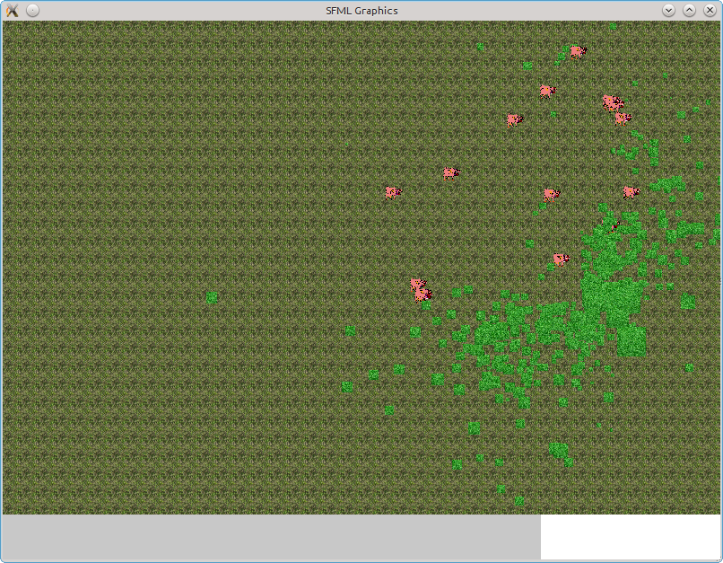

#moteurPhysique

Gestion de plusieurs entités et de leur déplacement. On peut aussi construire une unité à partir du batiment.

##Compiler

Pour compiler :
 * Installer SFML 2.0 :
  * télécharger https://github.com/LaurentGomila/SFML/archive/2.0.tar.gz
  * tar xzf archive.tgz
  * cmake
  * make
  * sudo make install
 * puis dans le dossier de ce projet :
  * make ou bien utiliser qtcreator : qtcreator moteurPhysique.creator

